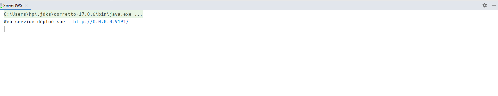
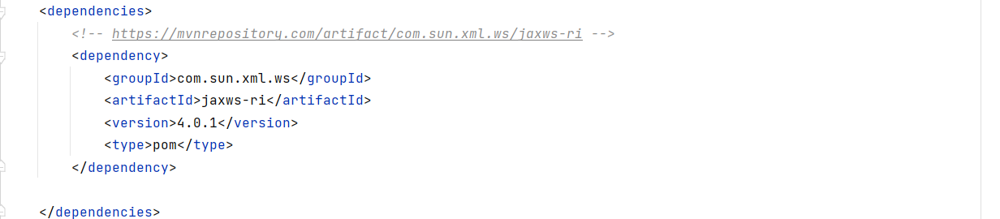
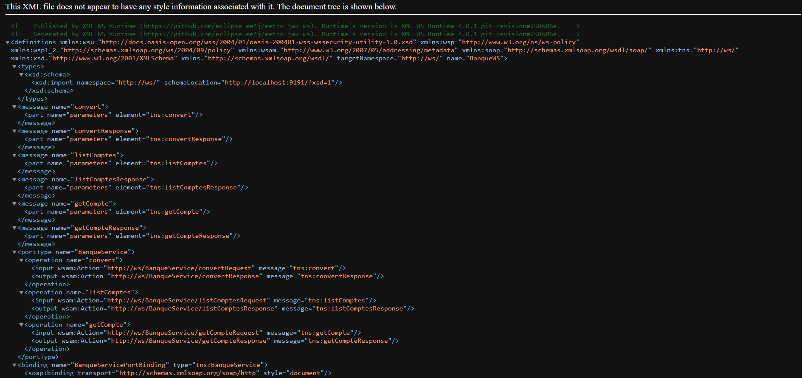
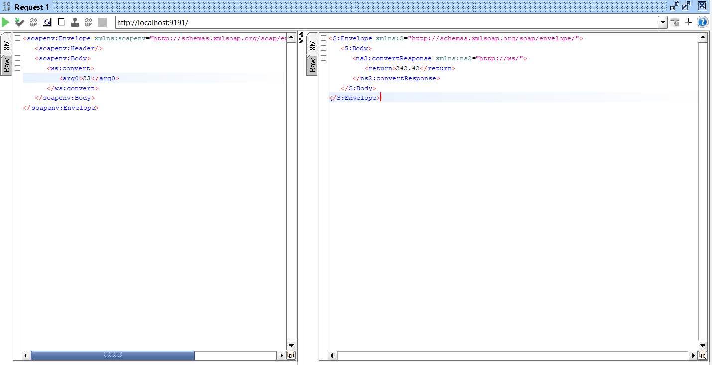
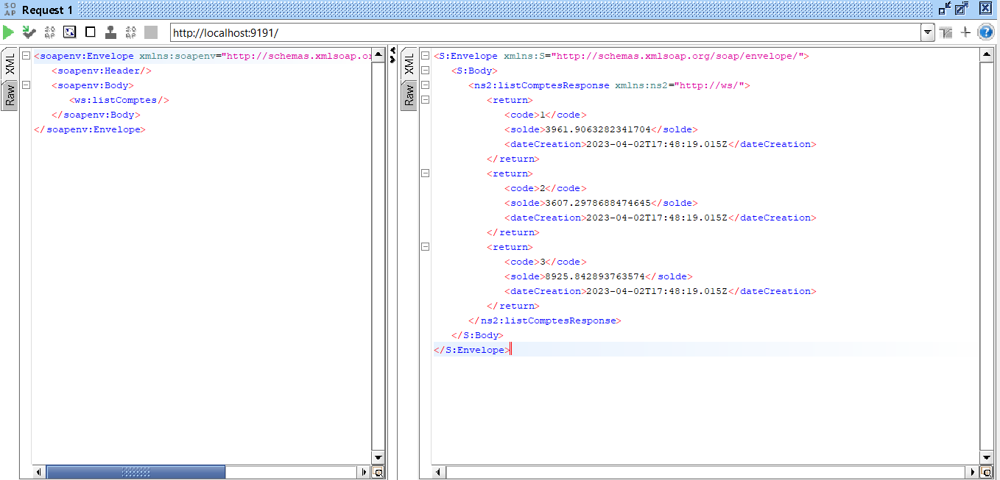
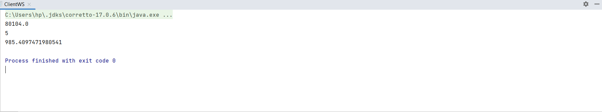
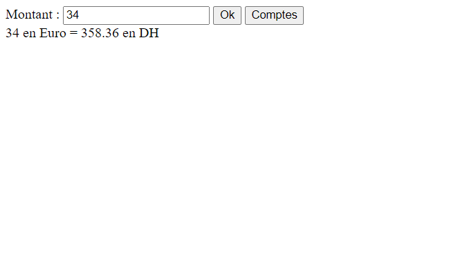

<h2>Compte Rendu 2</h2>
1. Web service permet de : 
   • Convertir un montant de l’auro en DH
   • Consulter un Compte
   • Consulter une Liste de comptes

2. Déployer le Web service avec un simple Serveur JaxWS

3. Consulter et analyser le WSDL avec un Browser HTTP

4. Tester les opérations du web service avec SoapUI

5. Un Client SOAP Java

6. Un Client SOAP PHP

7. Déployer le Web Service dans un Projet Spring Boot
   